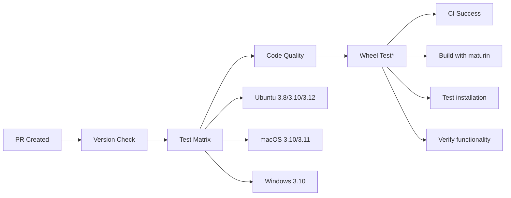
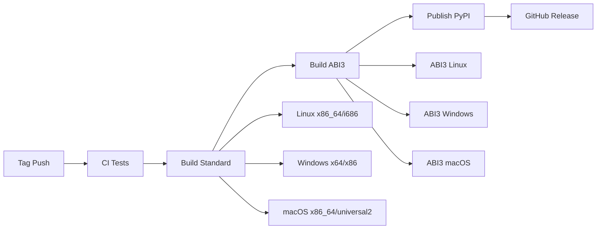

# PyRustor CI Architecture

## Overview

PyRustor uses a simplified, reliable CI architecture designed to ensure consistency between PR testing and release builds. The system prioritizes early problem detection while maintaining efficient execution times.

## Core Principles

1. **PR-Release Consistency**: What passes in PR will pass in Release
2. **Simplicity**: Clear, maintainable configuration over complex abstractions
3. **Reliability**: Stable Python versions and proven build tools
4. **Efficiency**: Focused testing matrix covering critical combinations

## Workflow Structure

### Primary CI Workflow (`ci.yml`)

```yaml
jobs:
  version-check    # Ensures version consistency across files
  test            # Core testing across 6 critical platform combinations  
  lint            # Code quality checks (Rust + Python)
  wheel-test      # Release compatibility verification
  ci-success      # Overall status gate
```

#### Testing Matrix

| Platform | Python Versions | Purpose |
|----------|----------------|---------|
| Ubuntu | 3.8, 3.10, 3.12 | Min support, stable, latest |
| macOS | 3.10, 3.11 | Stable versions (avoid 3.9 gettext) |
| Windows | 3.10 | Cross-platform compatibility |

### Supporting Workflows

#### Build Workflows
- **`build.yml`**: Standard wheel building for all platforms
- **`build-abi3.yml`**: ABI3 wheels for broad compatibility
- **`release.yml`**: Orchestrates testing, building, and publishing

#### Utility Workflows
- **`version-sync.yml`**: Maintains version consistency
- **`pr-commands.yml`**: Handles PR automation commands

## Key Design Decisions

### 1. Eliminated Python 3.9
**Problem**: Python 3.9.23 on macOS required gettext library, causing CI failures
**Solution**: Use stable versions (3.8, 3.10, 3.11, 3.12) that don't have dependency issues

### 2. Unified Build Tools
**Problem**: PR used custom actions, Release used PyO3/maturin-action
**Solution**: Both use `PyO3/maturin-action` with identical parameters

### 3. Simplified Actions
**Problem**: Complex custom actions (setup-pyrustor, build-and-test) were hard to maintain
**Solution**: Direct use of standard actions (setup-python, setup-uv, maturin-action)

### 4. Focused Testing Matrix
**Problem**: 15+ combinations caused slow CI and maintenance overhead
**Solution**: 6 critical combinations covering essential platform/Python pairs

## Build Process

### Development (PR)


*Wheel test runs on main branch or with `test-wheels` label

### Release


## Configuration Files

### Main CI (`ci.yml`)
- **Lines**: 200 (down from 280)
- **Jobs**: 5 (down from 8)
- **Matrix**: 6 combinations (down from 15+)
- **Dependencies**: Standard actions only

### Build Tools
- **Rust**: `dtolnay/rust-toolchain@stable`
- **Python**: `actions/setup-python@v5`
- **Package Manager**: `astral-sh/setup-uv@v6`
- **Build Tool**: `PyO3/maturin-action@v1`
- **Task Runner**: `extractions/setup-just@v3`

## Quality Gates

### PR Requirements
- ✅ Version consistency across all files
- ✅ All platform tests pass
- ✅ Code quality checks pass
- ✅ Basic functionality verified

### Release Requirements
- ✅ All PR requirements
- ✅ Wheel building succeeds for all platforms
- ✅ ABI3 compatibility verified
- ✅ Installation and import tests pass

## Troubleshooting

### Common Issues

#### Version Inconsistency
```bash
# Fix automatically
just sync-version

# Or manually update:
# - Cargo.toml
# - pyproject.toml  
# - python/pyrustor/__init__.py
```

#### Platform-Specific Failures
- **macOS**: Avoid Python 3.9, use 3.10+ for stability
- **Windows**: Ensure PowerShell compatibility in scripts
- **Linux**: Standard Ubuntu environment, minimal dependencies

#### Build Failures
- **Rust**: Check `cargo clippy` and `cargo fmt`
- **Python**: Check `ruff check` and `ruff format`
- **Wheels**: Verify `maturin build` works locally

## Performance

### Execution Times (Approximate)
- **Version Check**: 1-2 minutes
- **Test Matrix**: 8-12 minutes (parallel)
- **Code Quality**: 2-3 minutes
- **Wheel Test**: 3-5 minutes
- **Total**: 10-15 minutes

### Optimization Strategies
- **Parallel execution**: Matrix jobs run concurrently
- **Smart caching**: Rust build cache, uv cache
- **Conditional jobs**: Wheel test only when needed
- **Early termination**: Fail fast on critical errors

## Migration Notes

### From Legacy CI
1. **Backup**: Legacy CI moved to `ci-legacy.yml`
2. **Actions**: Removed `build-and-test` action
3. **Dependencies**: Simplified to standard actions
4. **Matrix**: Reduced from complex include/exclude to simple list

### Breaking Changes
- **Python 3.9**: No longer tested or supported in CI
- **Custom Actions**: `setup-pyrustor` simplified, `build-and-test` removed
- **Test Types**: Simplified to basic/full, removed specialized types

## Maintenance

### Regular Tasks
- **Monthly**: Review Python version support
- **Quarterly**: Update action versions
- **Per Release**: Verify wheel compatibility

### Monitoring
- **CI Performance**: Track execution times
- **Failure Rates**: Monitor platform-specific issues
- **Coverage**: Ensure adequate test coverage

This architecture provides a solid foundation for reliable, maintainable CI while ensuring consistency between development and release processes.
