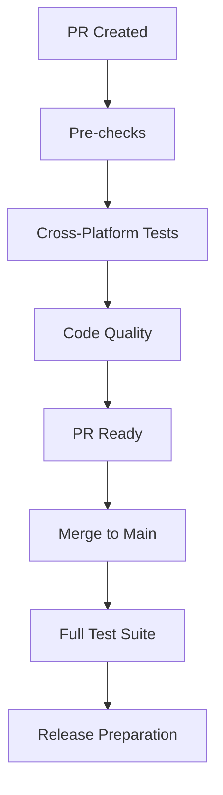

# PyRustor Testing Strategy

This document outlines the comprehensive testing strategy for PyRustor, including cross-platform testing, quality gates, and CI/CD workflows.

## Overview

PyRustor uses a multi-layered testing approach to ensure reliability across different platforms and Python versions. Our strategy focuses on catching issues early in the development process while maintaining efficient CI/CD pipelines.

## Testing Layers

### 1. PR-Level Testing (Cross-Platform)

**Trigger**: Every pull request
**Purpose**: Catch platform-specific issues before they reach main branch

#### Platform Matrix
- **Ubuntu Latest**
  - Python 3.8 (minimum supported version)
  - Python 3.10 (stable version)
  - Python 3.12 (latest stable)

- **macOS Latest**
  - Python 3.9 (known gettext dependency issue)
  - Python 3.10 (stable version)

- **Windows Latest**
  - Python 3.10 (stable version for Windows compatibility)

#### Quality Gates
All PR tests must pass before merging:
- ✅ Code compilation (Rust + Python)
- ✅ Unit tests (Python bindings)
- ✅ Integration tests
- ✅ Code quality checks (rustfmt, clippy, ruff)
- ✅ Type stub generation
- ✅ Platform-specific dependency resolution

### 2. Main Branch Testing (Comprehensive)

**Trigger**: Push to main branch, manual dispatch
**Purpose**: Full validation across all supported configurations

#### Extended Platform Matrix
- **Ubuntu**: Python 3.8, 3.9, 3.10, 3.11, 3.12, 3.13
- **macOS**: Python 3.8, 3.9, 3.10, 3.11, 3.12
- **Windows**: Python 3.8, 3.9, 3.10, 3.11, 3.12

#### Additional Tests
- Performance benchmarks
- Security audits (cargo audit, safety, bandit)
- Documentation generation
- Wheel building and testing

### 3. Specialized Testing Workflows

#### macOS Python 3.9 Verification
**File**: `.github/workflows/test-macos-python39.yml`
**Purpose**: Specifically test the gettext dependency fix for Python 3.9 on macOS

**Triggers**:
- Manual dispatch
- Changes to setup actions
- Changes to CI workflows

**Verification Steps**:
1. Install Python 3.9 with gettext dependencies
2. Verify library linking and symlinks
3. Test PyRustor build and import
4. Run basic functionality tests

## Platform-Specific Considerations

### macOS
- **Python 3.9 Gettext Issue**: Automatic installation and linking of gettext library
- **Homebrew Dependencies**: Managed through setup-pyrustor action
- **Code Signing**: Future consideration for distribution

### Windows
- **Path Handling**: Test Windows-specific path separators
- **PowerShell vs CMD**: Ensure compatibility with both shells
- **Visual Studio Build Tools**: Rust compilation requirements

### Ubuntu/Linux
- **System Dependencies**: Minimal external dependencies
- **Container Compatibility**: Future Docker testing
- **Distribution Variants**: Focus on Ubuntu LTS versions

## Quality Metrics

### Code Coverage
- **Target**: >80% for Python bindings
- **Rust Coverage**: Tracked via tarpaulin
- **Combined Reporting**: Integrated coverage reports

### Performance Benchmarks
- **Baseline**: Established performance metrics
- **Regression Detection**: Automated performance comparison
- **Memory Usage**: Monitor memory consumption patterns

### Security
- **Dependency Scanning**: Regular security audits
- **Code Analysis**: Static analysis for security issues
- **Supply Chain**: Verify dependency integrity

## Workflow Dependencies

## Failure Handling

### PR Failures
1. **Platform-Specific**: Isolate and fix platform issues
2. **Test Failures**: Investigate and resolve test issues
3. **Quality Issues**: Address linting and formatting problems

### Main Branch Failures
1. **Immediate Investigation**: High priority for main branch issues
2. **Rollback Consideration**: If critical functionality is broken
3. **Hotfix Process**: Fast-track critical fixes

## Continuous Improvement

### Monitoring
- **CI Performance**: Track build times and resource usage
- **Test Reliability**: Monitor flaky tests and false positives
- **Platform Coverage**: Ensure adequate platform representation

### Updates
- **Python Versions**: Add support for new Python releases
- **Platform Updates**: Adapt to new GitHub Actions runners
- **Tool Updates**: Keep testing tools and dependencies current

## Implementation Notes

### Recent Improvements (2025-01-29)
- **Cross-Platform PR Testing**: Moved from Ubuntu-only to multi-platform
- **macOS Python 3.9 Fix**: Automatic gettext dependency resolution
- **Specialized Workflows**: Added targeted testing for known issues

### Future Enhancements
- **Container Testing**: Docker-based testing environments
- **Performance Regression**: Automated performance monitoring
- **Extended Platform Support**: Additional OS and architecture combinations

## Troubleshooting

### Common Issues
1. **macOS gettext**: Resolved via automatic installation in setup-pyrustor
2. **Windows Path Issues**: Use cross-platform path handling
3. **Python Version Conflicts**: Matrix testing catches version-specific issues

### Debug Workflows
- Enable debug output in specialized workflows
- Comprehensive environment information collection
- Detailed failure reporting and analysis

This testing strategy ensures PyRustor maintains high quality and reliability across all supported platforms and Python versions while providing fast feedback to developers.
